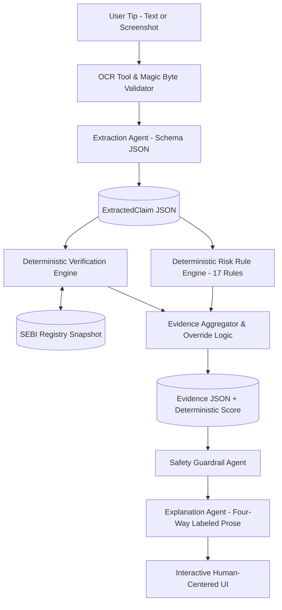

# TipCheck 🛡️
### AI-Assisted Evidence Engine for Investment Tip Verification
**Hackathon Track:** Agents for Humans — Everyday Agents / FinTech & Commerce

[](https://investment-risk-analyzer.netlify.app/)

> *"We don't ask AI if it's a scam. We check if the SEBI registration is even real."*

---

## Executive Summary

TipCheck is an evidence-first system that extracts structured claims from suspicious investment tips (text messages or screenshots) and checks them against an authoritative SEBI (Securities and Exchange Board of India) registration dataset using deterministic matching and rule evaluation. 

Unlike generic LLM wrappers that hallucinate opinions with zero evidence trail, TipCheck strictly separates the workflow:
1. **LLM Extraction & Grounded Explanation (Schema-Constrained)**: Reads raw text or OCR screenshots and normalizes claims into strict JSON schemas.
2. **Deterministic Verification & Scoring (Zero Hallucination)**: Runs exact & fuzzy matching against authoritative SEBI registration records and scores manipulation patterns using 17 fixed rules (`rules/rules.yaml`).

The final verdict (`LOW CONCERN`, `NEEDS VERIFICATION`, or `HIGH-RISK INDICATORS`) is **never** decided by an AI model.

---

## Core Architecture



### The Four-Way Evidence Labeling Standard
Every line item in the verdict carries an explicit, tamper-proof tag:
- `[verified fact]`: Direct match from the official SEBI registry snapshot (date-stamped).
- `[extracted claim]`: What the incoming tip asserts (unverified user content).
- `[rule signal]`: Manipulation pattern triggered by the deterministic rule engine.
- `[ai explanation]`: Plain-language synthesis strictly grounded in computed evidence.

---

## 17 Fixed Deterministic Rules (`rules/rules.yaml`)

| Rule ID | Category | Description | Severity | Score |
|---|---|---|---|---|
| **REG-01** | Regulatory | Registration number not found in registry | High | +30 |
| **REG-02** | Regulatory | Registration number found but inactive/suspended | High | +25 |
| **REG-03** | Regulatory | Registry service unavailable during lookup | Info | 0 |
| **REG-04** | Regulatory | Missing registration number with advisory claims | High | +20 |
| **ID-01** | Identity | Claimed entity name mismatches registered name | High | +30 |
| **ID-02** | Identity | Claimed entity name partially matches registered name | Medium | +10 |
| **ID-03** | Identity | Cross-registration identity swapping detected | High | +25 |
| **FIN-01** | Financial | Guaranteed or risk-free return promised | High | +20 |
| **FIN-02** | Financial | Unrealistic return magnitude (>25% monthly or 100%+) | High | +20 |
| **FIN-03** | Financial | Unverifiable past performance claim | Medium | +10 |
| **PSY-01** | Psychological | Artificial urgency ("today only", "act now") | Medium | +10 |
| **PSY-02** | Psychological | Scarcity & exclusivity ("limited VIP slots") | Medium | +10 |
| **PSY-03** | Psychological | Social proof pressure | Low | +5 |
| **PAY-01** | Payment | Upfront fee requested before service delivery | High | +20 |
| **PAY-02** | Payment | Payment requested to personal UPI or unofficial account | High | +20 |
| **COMM-01** | Communication | Informal messaging handle only (no verified email/domain) | Low | +5 |
| **COMM-02** | Communication | Shortened or unverified invite link (bit.ly, t.me, wa.me) | Medium | +10 |

### Verdict Bucket Mapping
- `0 - 19`: **LOW CONCERN**
- `20 - 49`: **NEEDS VERIFICATION**
- `50+`: **HIGH-RISK INDICATORS**

> **Mandatory Override Rule:** If `registration_lookup == not_found` AND any `FIN-*` or `PAY-*` rule fires, the verdict is forced to **HIGH-RISK INDICATORS** regardless of numeric score.

---

## Security & Privacy Model

- **Anti-Prompt Injection**: Strict architectural isolation separates incoming tip text from system control flow. Injected commands cannot alter deterministic verification or rule scoring.
- **File Upload Security**: Enforces 5MB size limits, binary magic byte validation (`JPEG`, `PNG`, `WEBP`), filename path-traversal sanitization, and automatic EXIF metadata stripping.
- **HTTP Security Headers**: Delivers `X-Content-Type-Options: nosniff`, `X-Frame-Options: DENY`, `Referrer-Policy: strict-origin-when-cross-origin`, and `X-XSS-Protection: 1; mode=block`.
- **In-Memory Rate Limiting**: Capped at 60 requests per minute per IP to prevent DoS flooding.
- **Zero Raw PII Logging**: Tip text, financial numbers, and user identifiers are never persisted to disk logs. Only anonymized operational metrics are recorded.
- **No Financial Advice**: Hardcoded safety guardrail prevents the engine from giving buy/sell recommendations, stock ratings, or price targets.

---

## Quick Start (Local Run)

### 1. Prerequisites
- Python 3.10+
- Node.js 18+ and npm

### 2. Configure Environment
```bash
# Copy the template to .env (defaults are pre-configured for local offline run)
cp .env.example .env
```

### 3. Start the Backend (FastAPI)
```bash
# In the project root:
pip install -r requirements.txt
python -m uvicorn backend.main:app --host 127.0.0.1 --port 8000 --reload
```
API Documentation is live at `http://127.0.0.1:8000/docs`.

### 4. Start the Frontend (Vite React + TypeScript)
```bash
cd frontend
npm install
npm run dev
```
Open `http://localhost:5173` in your browser.

### 5. Run Automated Tests
```bash
python -m pytest tests/ -v
```
Runs all 27 automated tests covering API endpoints, orchestrator workflow, 16 rule detections, verification matching, prompt injection resilience, rate limiting, and security headers.

---

## Demo Scenarios

The user interface includes one-click preloaded test cases for rapid evaluation:

1. **Scenario A (High Risk)**:
   - *Input*: "JACKPOT NIFTY CALLS! SEBI Reg No: INA999888777. Guaranteed 50% monthly profit! Limited 10 VIP slots. Pay Rs 5000 via GPay to 9876543210@ybl."
   - *Result*: **HIGH-RISK INDICATORS** (Triggers REG-01, FIN-01, FIN-02, PSY-01, PSY-02, PAY-01, PAY-02 + High-Risk Override).
2. **Scenario B (Needs Verification)**:
   - *Input*: "Market Advisory from Motilal Oswal Financial Services Limited. SEBI Reg No: INA000000037. We promise 40% guaranteed returns on smallcap portfolio."
   - *Result*: **NEEDS VERIFICATION** (Valid registered entity, but aggressive guaranteed return claim triggers cautionary flags).
3. **Scenario C (Low Concern)**:
   - *Input*: "Quarterly Research Note: Kotak Investment Advisors Limited (SEBI Reg No: INA000008434). Market outlook suggests moderate inflation cooling. Investments are subject to market risks."
   - *Result*: **LOW CONCERN** (Valid active registration, matching legal entity, standard risk disclosures, zero manipulation signals).

---

## External Dependencies & Production Status

TipCheck is engineered to run **100% locally out-of-the-box** without requiring paid cloud keys. Optional production integrations are cleanly abstracted:

- **Amazon Bedrock**: Configurable via `BEDROCK_MODEL_ID_EXTRACTION` in `.env` for cloud LLM extraction in high-throughput deployments.
- **Amazon Textract**: Configurable via AWS IAM credentials for cloud document OCR. Local mode uses PyTesseract or prompts manual text entry.
- **Amazon DynamoDB**: Optional persistent store for historical analysis records (`DYNAMODB_TABLE_ANALYSIS_REQUESTS`).
- **SEBI Registry Data**: Local mode operates against an authoritative synthetic snapshot (`registry/sebi_intermediaries_sample.json`). Live web scraping or API polling requires formal regulatory data partnerships.

---

## License & Statutory Disclaimer

TipCheck is an educational and analytical tool developed for the Agents for Humans Hackathon. TipCheck provides regulatory claim verification and pattern detection signals based on public datasets. TipCheck is **not** a SEBI-registered Investment Adviser (RIA), does not assess the investment merit of any asset, and does not provide financial or legal advice. Always independently verify registrations directly on [sebi.gov.in](https://www.sebi.gov.in).
