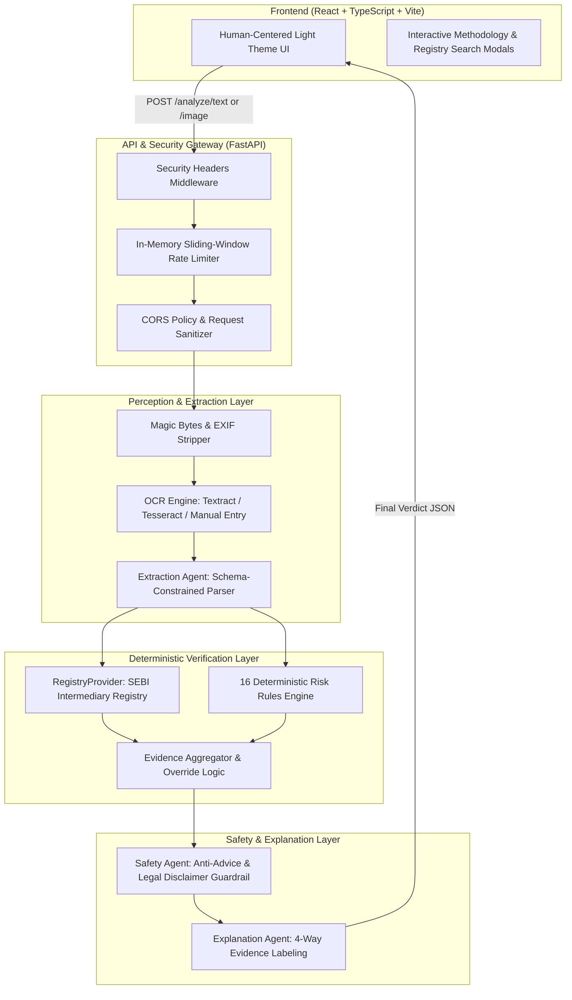

# TipCheck — Architecture & Engineering Specification

## 1. Architectural Philosophy

TipCheck is an **evidence-first verification engine** built to combat financial misinformation, unauthorized investment advisory, and securities manipulation schemes circulating across messaging platforms (WhatsApp, Telegram, SMS, Social Media).

### The Golden Rule of TipCheck
> **"Never let an AI model decide whether an investment tip is safe."**

Generic LLM wrappers are prone to hallucinating legitimacy, misunderstanding regulatory nuances, or being subverted by adversarial prompt injection. TipCheck solves this by strictly bifurcating the workflow:
- **Agents are used strictly for Perception & Synthesis**: Normalizing messy text into strictly typed JSON schemas (`ExtractedClaim`) and translating verified evidence into clear human prose.
- **Deterministic Systems are used for Verification & Scoring**: Exact and normalized matching against SEBI registry records, evaluation against 16 immutable manipulation rules (`rules/rules.yaml`), and evidence aggregation.

---

## 2. End-to-End System Pipeline

---

## 3. Four-Way Evidence Attribution Standard

To maintain complete transparency and prevent deceptive AI summaries, all insights returned to the user are labeled under four distinct categories:

1. **`[verified fact]`**: Directly verified against public SEBI intermediary records (e.g. registration validity, official name, authorized advisory category, validity date).
2. **`[extracted claim]`**: Content asserted by the incoming tip itself (unverified claims made by the sender).
3. **`[rule signal]`**: Deterministic pattern flagged by the 16 rules in `rules/rules.yaml` (e.g., artificial urgency, guaranteed returns, personal UPI payments).
4. **`[ai explanation]`**: Plain-language synthesis strictly grounded in verified facts and detected signals, without speculative inferences.

---

## 4. The 16 Deterministic Risk Rules

| Rule ID | Category | Rule Name | Severity | Score | Description |
| :--- | :--- | :--- | :---: | :---: | :--- |
| **REG-01** | Regulatory | Registration Not Found | High | +30 | Claimed registration number does not exist in the official SEBI registry. |
| **REG-02** | Regulatory | Inactive Registration | High | +25 | Registration number is found, but its status is suspended, surrendered, or expired. |
| **REG-03** | Regulatory | Registry Service Unavailable | Info | 0 | Official registry was unreachable during lookup; prompts manual verification. |
| **ID-01** | Identity | Entity Name Mismatch | High | +30 | Claimed adviser/company name does not match the legal entity registered under the given number. |
| **ID-02** | Identity | Partial Name Match | Medium | +10 | Entity name has minor discrepancies; flagged for manual review. |
| **ID-03** | Identity | Identity Swapping Detected | High | +25 | Claimed credentials belong to a different recognized institution than stated. |
| **FIN-01** | Financial | Guaranteed Return Language | High | +20 | Use of terms like "100% guaranteed", "risk-free", "assured profits" (prohibited under SEBI regulations). |
| **FIN-02** | Financial | Unrealistic Return Magnitude | High | +20 | Promises returns exceeding 25% monthly or 100% annually. |
| **FIN-03** | Financial | Unverifiable Past Performance | Medium | +10 | Cites past track records without audit or benchmark disclosures. |
| **PSY-01** | Psychological | Artificial Urgency | Medium | +10 | Pressure phrases like "act now", "today only", "closing in 1 hour". |
| **PSY-02** | Psychological | Artificial Scarcity / VIP Exclusivity| Medium | +10 | Claims such as "only 5 slots left", "exclusive VIP insider group". |
| **PSY-03** | Psychological | Social Proof Pressure | Low | +5 | Fabricated testimonials, fake transaction screenshots, or group member claims. |
| **PAY-01** | Payment | Upfront Fee Before Service | High | +20 | Requires upfront registration fee or activation charge before providing advice. |
| **PAY-02** | Payment | Personal Payment Handle | High | +20 | Directs fees to personal UPI handles (`@okaxis`, `@ybl`, `@paytm`) instead of institutional banking accounts. |
| **COMM-01**| Communication| Informal Messaging Only | Low | +5 | Entity provides only personal Telegram/WhatsApp links with no corporate domain/email. |
| **COMM-02**| Communication| Shortened / Obfuscated Links | Medium | +10 | Uses URL shorteners (bit.ly, tinyurl, t.me, wa.me) to conceal destination. |

### Verdict Buckets & Mandatory Overrides
- **`0 - 19`**: **LOW CONCERN** — Verified active registration, matching legal entity, no prohibited financial promises or manipulation signals.
- **`20 - 49`**: **NEEDS VERIFICATION** — Ambiguous signals, partial name match, or missing registration details requiring further check.
- **`50+`**: **HIGH-RISK INDICATORS** — Severe manipulation signals, invalid registrations, or prohibited guaranteed return language.
- **MANDATORY OVERRIDE RULE:** If `registration_lookup == not_found` AND (`FIN-*` or `PAY-*` rules fire), the engine automatically assigns **`HIGH_RISK_INDICATORS`** regardless of numeric score.

---

## 5. Security & Privacy Architecture

1. **Zero-Trust Input Processing**: User messages and uploaded files are treated as untrusted data. Filenames are stripped of path traversal characters (`..`, `/`, `\`).
2. **Magic Byte File Validation**: Image uploads are verified for authentic binary headers (`\xff\xd8\xff` for JPEG, `\x89PNG\r\n\x1a\n` for PNG, `RIFF...WEBP` for WebP) before PIL decoding.
3. **EXIF Metadata Stripping**: Uploaded screenshots have all camera, geolocation, and device metadata expunged immediately upon ingest.
4. **Privacy-Preserving Logs**: User tip contents and personal identifiers are never written to disk logs or telemetry. Only operational metrics (step execution latency, rule IDs fired) are recorded.
5. **Anti-Prompt Injection Isolation**: User inputs are strictly processed through schema validation. System-level instructions, safety boundaries, and deterministic rule scoring cannot be altered or bypassed by user text commands.
6. **Defense-in-Depth HTTP Headers**: The API serves strict headers including `X-Content-Type-Options: nosniff`, `X-Frame-Options: DENY`, and `Referrer-Policy: strict-origin-when-cross-origin`.
7. **In-Memory Rate Limiting**: Protects against abuse by capping submissions to 60 requests per minute per client IP.
